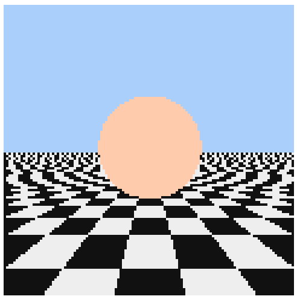
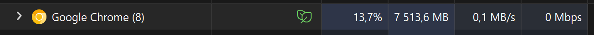

# 👾 CSS Ray Tracer 👾

A unusual ray tracer implemented **purely in CSS** — no pre-rendered images, no JavaScript for rendering, just cutting-edge CSS features! Runs live in your browser using the latest Chrome/Edge (Canary or Dev) with experimental flags enabled.

---

## Single SCSS source code file

**You can change and edit compilable parameters.**
- 🎨 **[Ray-Tracing-SCSS](./unified.scss)** 🎨
- 🖨️ [JS-DOM-Loader](./canvas-gen.js) 🖨️

**Such as:**
- Your features or fixes
- Iteration count
- Enable (or not) reflections
- Possible CSS optimizations
- Rendering resolutions

---

## Features & Optimizations

- **SCSS** for easier and cleaner code management
- **JavaScript** is used **only** to generate the pixel grid markup (no rendering logic)
- **Progressive (async) markup rendering** for better performance
- Compiles to standard CSS — no custom build steps required
- Uses a **120x120 grid** for pixel representation

---

## Technologies & Techniques

- Advanced **CSS math utilities and tricks**
- **CSS Custom Properties** (fully editable)
- **CSS Custom Functions** (experimental)
- Latest **CSS Math Functions**
- **CSS Typed OM**
- **SCSS** for maintainability

---

## Getting Started

⚠️ **Requires the newest version of Chrome or Edge (Canary/Dev) with Experimental Web Platform features enabled.**  

> Make sure to enable the `chrome://flags/#enable-experimental-web-platform-features` flag.

### Install 

- `npm install -D`
- `npm run dev`

### Naive guide

> Suggested by AI

1. Clone or download this repository.
2. Open `index.html` in your supported browser.
3. Enjoy the magic of pure CSS ray tracing!

---

## Notes

- This project is a demonstration of what’s possible with modern and experimental CSS — expect things to break as browser support evolves!
- No pre-rendered images or JavaScript-based rendering: **all visuals are computed in real-time by CSS.** 

---

## 🖼️ Previews 🖼️

  
 📷 Old rendering without shading 📷 

  > Made before re-design of main page. In this version I'm isn't enabled any shading.

  

###

---

## 🌡️ Stress Test 🌡️

**These options isn't included in factory box.** This test made in April of 2025 year. Currently, didn't made actual results.

**What was enabled:** 
  - reflections
  - two iterations level (exclude first rays) 
  - higher pixel resolution...

**As you can see:** 
  - too expensive RAM usage
  - roundly 1 minute to this frame

###

  
🖼️ <b>Result Picture</b> 🖼️

  

###

---

###

**Have fun exploring the bleeding edge of CSS!**
