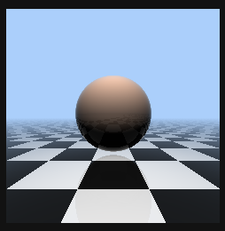

# CSS Ray Tracer

CSS math 'black hole', in Chrome/Edge **135** ~~137 Canary~~ (and beyond), with experimental flags... **pure CSS only!**

**Runs in browser, i.e. in runtime side! There is no pre-compiled rendering results in CSS.**

## Optimizations

- SCSS for simplify code writing
- JS used only for generate markup (**pixel grid**)
- Progressive (async) markup rendering (*optimization*)
- Compiles into real CSS code
- Used grid 120x120 elements

## What I used?

- CSS math utils and tricks
- CSS Custom properties (**editable**)
- CSS Custom functions (**experimental**)
- Latest CSS Math functions
- CSS Typed OM
- SCSS to simplify code-hell

## How to run?

⚠️ You needs Google Chrome Canary version, with enabled experimental web-platform features flag. ⚠️

- `npm install -D`
- `npm run dev`

Enjoy to see scene!

## Previews

Made before re-design of main page. In this version I'm isn't enabled any shading.

## 🌡️ Stress Test 🌡️

Too expensive RAM usage! And very slow rendering (roundly 1 minute to this frame)!

